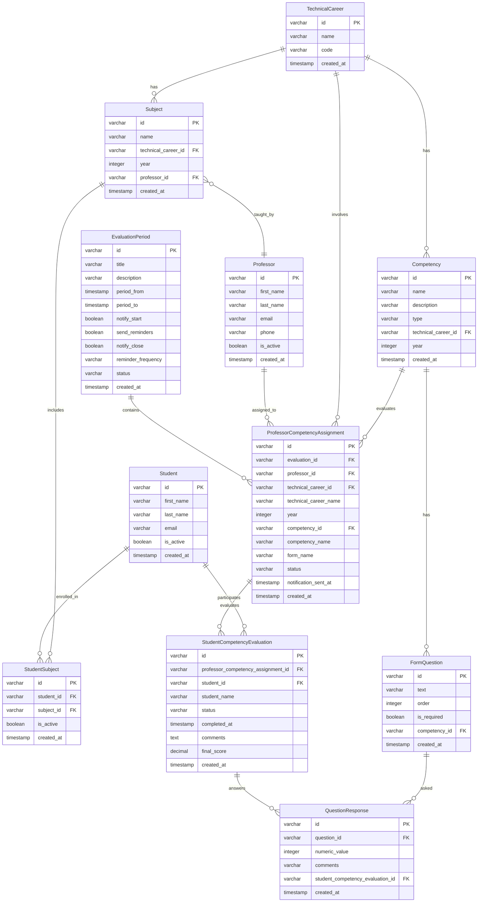

## 📋 Resumen General

El sistema permite a los profesores evaluar estudiantes en competencias específicas durante períodos de evaluación definidos.

### **Estructura Educativa**

- **TechnicalCareer**: Representa tecnicaturas (ej: Desarrollo de Software)
- **Subject**: Asignaturas dentro de cada carrera, asignadas a años específicos (1º, 2º, 3º año)
- **Professor**: Instructores que imparten asignaturas (1 profesor por asignatura por año por carrera)
- **Student**: Estudiantes inscriptos en asignaturas

### **Marco de Evaluación**

- **Competency**: Habilidades/capacidades que necesitan ser evaluadas, vinculadas a carreras y años específicos
- **FormQuestion**: Preguntas utilizadas para evaluar cada competencia (escala Likert 1-5)
- **EvaluationPeriod**: Ventanas de tiempo cuando las evaluaciones tienen lugar (con notificaciones y recordatorios)

### **Flujo de Asignación y Evaluación**

1. **ProfessorCompetencyAssignment**: Vincula profesores con competencias que deben evaluar durante un período específico
2. **StudentCompetencyEvaluation**: Evaluaciones individuales de estudiantes por parte de profesores
3. **QuestionResponse**: Respuestas específicas a preguntas del formulario con puntajes numéricos y comentarios

## 🔄 Reglas de Negocio

- Cada profesor imparte **una asignatura por año por carrera técnica**
- Los estudiantes son evaluados en competencias **relevantes a sus asignaturas inscriptas**
- Todos los estudiantes de una asignatura son evaluados usando las **mismas preguntas del formulario**
- Los profesores proporcionan **puntajes individuales y retroalimentación** para cada estudiante
- Los períodos de evaluación tienen **sistemas configurables de notificación y recordatorios**

## 🎯 Relaciones Clave

- **Dirigido por períodos**: Todo fluye desde EvaluationPeriod → Asignaciones → Evaluaciones Individuales
- **Jerárquico**: TechnicalCareer → Subject → Professor/Student → Competency → Questions → Responses
- **Trazable**: Rastro de auditoría completo desde la creación del período hasta los puntajes finales del estudiante

